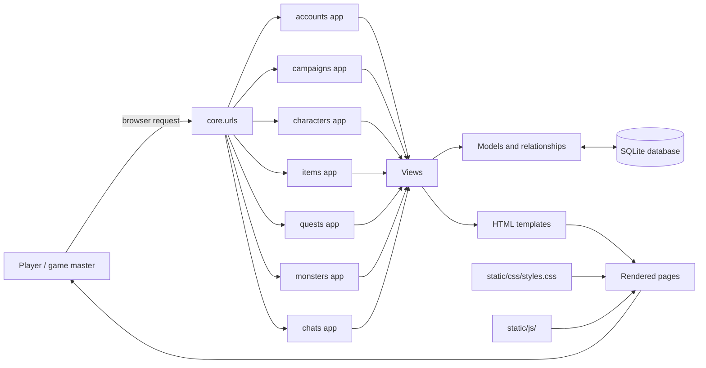
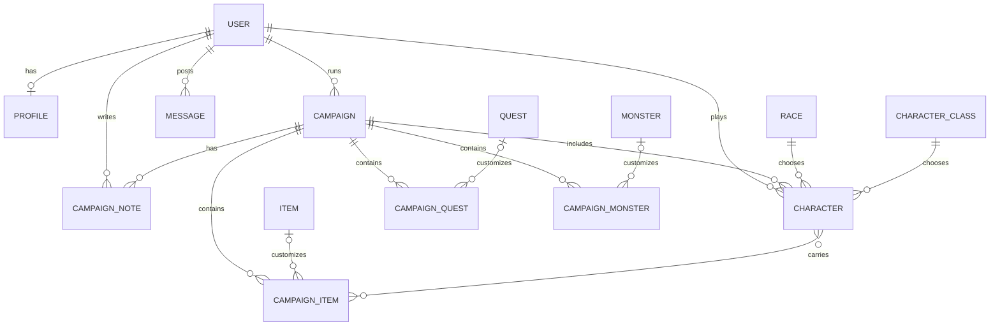

# QuestForge project overview

QuestForge is a Django application for organizing tabletop fantasy campaigns. It combines accounts, campaign and character management, game-master-only campaign notes, reusable libraries of items, quests, and monsters, and a community chat called the Tavern. The root URL renders a home page with current campaign and player counts.

## Application structure



## Campaign data



`Item`, `Quest`, and `Monster` are reusable catalog entries. Their campaign-specific counterparts can be customized for a particular campaign while retaining a link to the catalog entry. Each character belongs to one campaign and one player; a player can have at most one character in a campaign.

Campaign notes belong to a campaign and an author. They are private to the game master: only the game master sees the notes section and can create, edit, or delete notes. Campaign participants do not have access to notes. Joining an ended campaign is blocked in both the interface and the character creation view.

The Tavern is a site-wide message feed. Anyone can read messages; authenticated users can post. Users can edit or delete only their own messages.

## Access rules

- Campaign creation requires login; the authenticated user becomes the game master and is assigned to `Campaign.creator` by the server.
- Only the game master can update or delete a campaign or manage its campaign-specific items, quests, and monsters.
- Joining requires login and creates a character tied to the selected campaign and the current user.
- A player can have only one character per campaign, enforced by a database constraint.
- Players can delete their own character to leave a campaign.
- Profile email is visible only to the profile owner.
- Campaign notes are visible and editable only by the game master.
- Any authenticated user can post a Tavern message; only its author can edit or delete it.

## Local database fixture

`fixtures/db.json` is a Django data fixture generated from the current SQLite database. Restore it into a fresh local database after applying migrations:

```bash
python manage.py migrate
python manage.py loaddata fixtures/db.json
```

The fixture includes development test accounts: `admin` / `ghblehrb12` (administrator) and `Grob` / `ghblehrb12` (regular user). Use these accounts only for local testing.

## Main pages

| URL area | What it contains |
| --- | --- |
| `/` | Home page and community counts |
| `/accounts/` | User profiles and authentication |
| `/campaigns/` | Campaign details, characters, and campaign-specific content |
| `/tavern/` | Public community message feed; authenticated users can post |
| `/items/` | Reusable item catalog |
| `/quests/` | Reusable quest catalog |
| `/monsters/` | Reusable monster catalog |

The static stylesheet is `static/css/styles.css`. Project JavaScript is kept in `static/js/` and loaded by the templates that need it.
