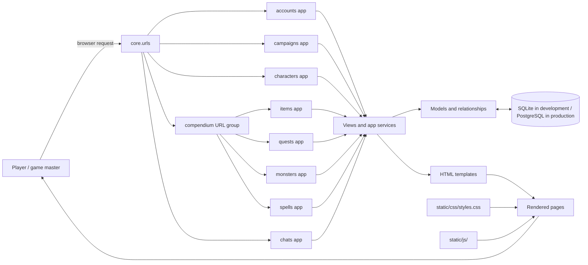
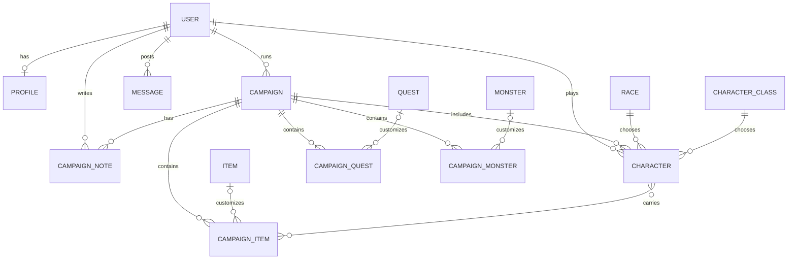

# QuestForge project overview

QuestForge is a deployed Django application for managing tabletop fantasy campaigns. The live site is [questforge-l9d4.onrender.com](https://questforge-l9d4.onrender.com/). It includes accounts and profiles, campaigns and characters, a Compendium of reusable items, quests, monsters, and spells, private game-master campaign notes, and a site-wide chat called the Tavern. The home page shows the current campaign and user counts.

## Application structure



## Apps and data relationships



`Item`, `Quest`, and `Monster` are reusable catalog entries. Campaign-specific versions can be customized for a particular campaign while retaining an optional link to the catalog entry. Each character belongs to one campaign and one player; a database constraint limits each player to one character per campaign.

Campaign notes are private to the game master. Only the campaign's game master can view or manage them. Joining a campaign requires authentication, and ended campaigns cannot be joined. Players leave by deleting their own character from the campaign.

The Tavern is a site-wide message feed. Anyone can read messages; authenticated users can post. Users can edit or delete only their own messages.

## Access rules

- Campaign creation requires login; the authenticated user is assigned as the game master by the server.
- Only the game master can update or delete a campaign or manage its campaign-specific items, quests, monsters, and notes.
- A player can have at most one character per campaign, enforced by a database constraint.
- Only authenticated users can join a campaign or post a Tavern message.
- A player can delete their own character to leave a campaign.
- Profile email is visible only to the profile owner.
- Tavern messages are public to read; only the author can edit or delete a message.

## Settings and deployment configuration

Settings are split into:

- `core/settings/base.py`: shared applications, middleware, templates, authentication, and static-file paths.
- `core/settings/dev.py`: local SQLite database and `DEBUG = True`.
- `core/settings/prod.py`: PostgreSQL connection from environment variables, `DEBUG = False`, and HTTPS redirects with secure session and CSRF cookies.

`manage.py` defaults to `core.settings.dev`. The WSGI and ASGI entry points default to `core.settings`; the deployed service must set `DJANGO_SETTINGS_MODULE=core.settings.prod` in its process environment before starting the application. The `.env.sample` file lists the database, secret-key, settings-module, and Render hostname variables. The settings module must be set in the service environment before Django starts; setting it only in `.env` is too late for startup selection.

Production settings use PostgreSQL environment variables, set `DEBUG = False`, and enforce HTTPS redirects and secure session/CSRF cookies. The production `ALLOWED_HOSTS` list uses Render's `RENDER_EXTERNAL_HOSTNAME`. Add any custom domain to the allowed hosts configuration before using it. Set a unique `DJANGO_SECRET_KEY` in Render; the fallback in shared settings is for local development only.

WhiteNoise middleware is configured immediately after Django's `SecurityMiddleware`. Source static assets are in `static/`, and collected assets are written to `staticfiles/` (`STATIC_ROOT`). Run the following with production settings during the deployment build, and whenever static assets change:

```bash
python manage.py collectstatic --noinput
```

`requirements.txt` includes Django, `python-dotenv`, PostgreSQL's psycopg2 driver, and WhiteNoise.

## Local database fixture

`fixtures/db.json` is a development snapshot. Restore it to a fresh local SQLite database after applying migrations:

```bash
python manage.py migrate
python manage.py loaddata fixtures/db.json
```

The fixture contains development accounts `admin` / `ghblehrb12` (administrator) and `Grob` / `ghblehrb12` (regular user). These credentials and data are for local testing only. Never use them in a public environment.

## Deployment notes

- Registration currently creates active accounts. The activation view and email service are placeholders, although the registration message still instructs users to check email. Email delivery and account activation need implementation or the messaging needs to be revised.
- Custom domains must be included in the production host allowlist.
- Production startup requires the Render service environment to select `DJANGO_SETTINGS_MODULE=core.settings.prod` and provide the database and secret-key variables.

## Main pages

| URL area | What it contains |
| --- | --- |
| `/` | Home page and community counts |
| `/accounts/` | Registration, authentication, profiles, and account pages |
| `/campaigns/` | Campaign list, search, details, characters, and campaign-specific content |
| `/tavern/` | Public community message feed |
| `/compendium/` | Compendium index |
| `/compendium/items/` | Reusable item catalog |
| `/compendium/quests/` | Reusable quest catalog |
| `/compendium/monsters/` | Reusable monster catalog |
| `/compendium/spells/` | Spell reference |
| `/hello-there/admin/` | Django administration site |

The site stylesheet is `static/css/styles.css`. Project JavaScript is kept in `static/js/` and loaded by templates that use it.
